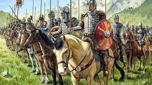

# VISIGODOS

Los visigodos fueron distintos pueblos bárbaros que, sin encontrar oposición, se
adentraron en Hispania. Este hecho coincide con el declive del Imperio romano. Se
estableció un tratado en el cual se disponía que los visigodos se asentaran en el sur de
la Galia y controlaran algunos territorios en Hispania.

## ÍNDICE

1. [Época](Epoca.md)
2. Arquitectura
3. Obras

### REFERENCIA
[Nathional Geographic España](https://historia.nationalgeographic.com.es/temas/visigodos)

## Época.md

La Hispania visigoda es la denominación del período histórico que abarca el
asentamiento del pueblo visigodo en la península ibérica, entre mediados del siglo V
y comienzos del siglo VIII.

## Arquitectura.md

Consta, por testimonios fidedignos de aquella época, la existencia de magníficas
iglesias en España, desde los últimos años del siglo VI hasta la invasión sarracena:
San Gregorio de Tours (siglo VI) dice de la iglesia de San Martín de Orense que era
cosa admirable, miro opere expedita.
Isidoro Pacense (siglo VIII) califica de obras maravillosas y elegantes las
construcciones de Wamba, en Toledo.
Pablo el Diácono (de Mérida, siglo VIII) elogia la iglesia de Santa Eulalia y el
baptisterio de San Juan de Mérida, cubiertos de pinturas;
San Eulogio de Córdoba (siglo IX) encomia las iglesias que fueron de Santa
Leocadia, en Toledo y de San Félix en Córdoba.

## Obras.md

Los monumentos de arquitectura que hoy se consideran como visigodos en nuestra
península aunque hayan sufrido posteriores y variadas restauraciones o solo se
conserven ruinas de ellos, se reducen a los siguientes:
La ermita de Santa María, situada en la localidad burgalesa de Quintanilla de las
Viñas.

